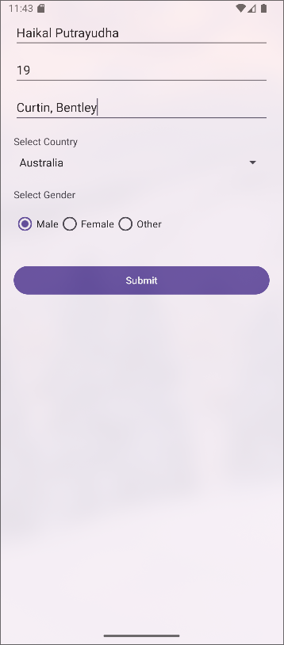
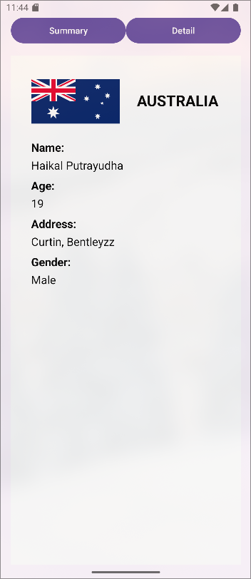

# RadioButton & Spinner Android Lab (Week 03 Workshop)

This is a sample Android project demonstrating the use of Spinner, RadioButton, RadioGroup, Fragments, and multiple data passing techniques between activities and fragments. The project is designed for educational purposes, especially for those learning about Android UI components and inter-component communication.

## Features

- **Country Selection:** Users can select a country from a Spinner dropdown.
- **Gender Selection:** Users can select a gender using a RadioGroup with RadioButtons.
- **Data Passing:** Demonstrates four ways to pass data from one activity to another:
  - Intent Extras
  - Bundle
  - Parcelable (via a `User` data class)
  - Singleton object
- **Fragments:**
  - `SummaryFragment` displays all the data received via different methods.
  - `DetailFragment` displays the selected country, gender, and a flag image.
- **Back Stack Navigation:** Switching between fragments adds to the back stack, allowing intuitive navigation.
- **State Retention:** Fragments and their state are retained on configuration changes (e.g., screen rotation).

## Screenshots

| Main Activity | Summary Fragment | Detail Fragment |
|--------------|-----------------|----------------|
|  |  |  |

## Project Structure

- `MainActivity.kt` - Main screen for user input.
- `SecondActivity.kt` - Hosts the fragments and manages navigation.
- `SummaryFragment.kt` - Shows all data passing methods.
- `DetailFragment.kt` - Shows selected country, gender, and flag.
- `User.kt` - Parcelable data class for passing user info.
- `DataHolder.kt` - Singleton for shared data.
- `res/layout/` - XML layouts for activities and fragments.
- `app/flags/` - Country flag images.

## How to Run

1. Clone this repository.
2. Open in Android Studio.
3. Build and run on an emulator or device.

## Author
- Haikal Putrayudha
- 21604483
